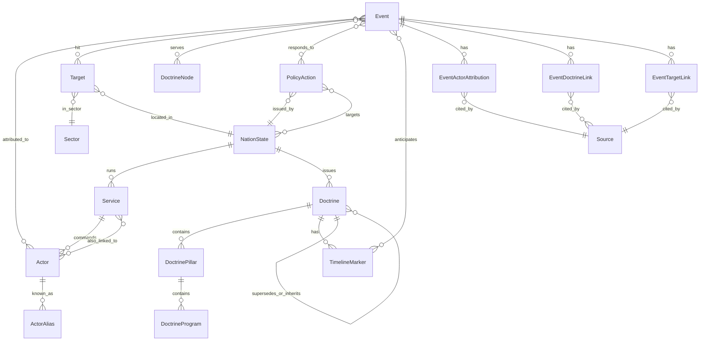

# AUSPEX data model (v0 draft, 2026-05-25)

> **⚠ Authoritative field-level schema is now [`SCHEMA.md`](SCHEMA.md)** — every YAML
> type, field, value type, enum, and FK, *data-derived* from the live corpus
> (`audit/introspect_schema.py`). This document is the earlier conceptual/design
> narrative and is partly stale; where they differ, SCHEMA.md (and the data) win.
>
> Status: draft, awaiting Kara review. Not load-bearing until research
> dossiers land and we sanity-check the model against real events.

## What this is

AUSPEX's analytic value is the *join* between cyber events and
strategic doctrine. This document specifies the entities, relations,
and key constraints that make that join queryable.

The data model has three layers:

1. **The doctrine atlas** — a hand-curated, source-anchored taxonomy
   of nation-state strategic frameworks (Made in China 2025, FPC 2023,
   Resistance Axis, etc.), broken down into pillars and named
   programs. Slow-changing. Edited by analysts. This is the moat.
2. **The actor & infrastructure registry** — nation-states, services,
   APT groups, their public attributions, and the seven-name aliasing
   problem. Slow-changing.
3. **The event log** — cyber incidents, dated, attributed, tagged
   against doctrine nodes with confidence. Fast-changing. Ingested
   continuously from feeds (CISA, OFAC, DOJ, vendor research) with
   analyst review on the doctrine tags.

The whole thing is structured so the doctrine atlas and the event log
can be queried *together* — that's the product.

## Entity-relationship diagram



*Note*: `DoctrineNode` in the diagram is a logical type — concretely,
a doctrine link points at *one of* a `Doctrine`, a `DoctrinePillar`,
or a `DoctrineProgram`. Modeled as a polymorphic FK; see §6.

## 1. Core entities

### 1.1 `NationState`

| field | type | notes |
|---|---|---|
| `id` | slug | `cn`, `ru`, `ir`, `kp`, `us` (ISO-3166 alpha-2 lowercase) |
| `name` | string | `People's Republic of China` |
| `short_name` | string | `China` |
| `summary` | markdown | 1–2 paragraph strategic posture |

### 1.2 `Service`

Intelligence / military service that runs cyber operations.

| field | type | notes |
|---|---|---|
| `id` | slug | `cn/mss`, `ru/gru/26165`, `ir/irgc-io`, `kp/rgb`, `us/nsa/tao` |
| `nation_state_id` | FK | |
| `name` | string | `Ministry of State Security` |
| `short_name` | string | `MSS` |
| `aliases` | string[] | `Guoanbu`, `Bureau 5` |
| `parent_service_id` | FK? | e.g., GRU 26165 parent is GRU |
| `active_since` | date? | |
| `active_until` | date? | nullable = still active |
| `mission` | string | one-line |
| `summary` | markdown | |

### 1.3 `Doctrine`

A named strategic framework. The top of the doctrine hierarchy.

| field | type | notes |
|---|---|---|
| `id` | slug | `cn/mic2025`, `ru/fpc-2023`, `ir/resistance-axis`, `kp/byungjin`, `us/ncs-2023` |
| `nation_state_id` | FK | |
| `name` | string | `Made in China 2025` |
| `short_name` | string? | `MIC2025` |
| `issued_by` | string | `State Council` |
| `issued_on` | date? | `2015-05-19` |
| `status` | enum | `active`, `superseded`, `inferred`, `historical` |
| `superseded_by_id` | FK? | self-reference |
| `inherits_from_ids` | FK[] | self-reference for build-on relationships |
| `official_text_url` | URL? | |
| `summary` | markdown | ~150 words |
| `cyber_relevance` | markdown | how this doctrine shapes cyber tasking |
| `sources` | FK[] → Source | |

### 1.4 `DoctrinePillar`

A major theme inside a doctrine. (MIC2025 has 10 sector pillars; FPC
2023 has thematic pillars like "near abroad," "energy weaponization,"
"sanctions resilience.")

| field | type | notes |
|---|---|---|
| `id` | slug | `cn/mic2025/semiconductors`, `cn/mic2025/aerospace`, `ru/fpc-2023/near-abroad` |
| `doctrine_id` | FK | |
| `name` | string | `Semiconductors and Information Technology` |
| `summary` | markdown | |
| `target_sectors` | FK[] → Sector | sectors this pillar implies should be targeted |
| `key_terms` | string[] | search-helpful synonyms |
| `sources` | FK[] → Source | |

### 1.5 `DoctrineProgram`

A specific named initiative under a pillar. Optional level — many
events don't need this granularity.

| field | type | notes |
|---|---|---|
| `id` | slug | `cn/mic2025/semiconductors/big-fund`, `cn/mcf/civil-military-aviation`, `ru/fpc-2023/energy/nordstream-leverage` |
| `pillar_id` | FK | |
| `name` | string | `Big Fund (China Integrated Circuit Industry Investment Fund)` |
| `summary` | markdown | |
| `active_period` | daterange? | |
| `sources` | FK[] → Source | |

### 1.6 `TimelineMarker`

Anchors for predictive analysis: explicit dates and milestones in a
doctrine. (MIC2025's 2025 milestone year, the 8th Party Congress
2021–2025 defense plan, the so-called Davidson Window for Taiwan, the
US 2024/2028 election cycles.)

| field | type | notes |
|---|---|---|
| `id` | slug | `cn/mic2025/2025-milestone`, `cn/taiwan/davidson-window-2027`, `kp/8th-congress-plan-end-2025` |
| `doctrine_id` | FK | |
| `date` | date or daterange | |
| `description` | markdown | |
| `cited_by` | FK[] → Source | |

### 1.7 `Actor`

An APT / cyber unit. The Microsoft "weather-name" / Mandiant "APT##"
/ CrowdStrike "{Animal}" / vendor-soup-of-the-day refer to this entity.

| field | type | notes |
|---|---|---|
| `id` | slug | `cn/mss/apt41`, `ru/gru/26165/apt28`, `kp/rgb/lazarus`, `ir/mois/muddywater` |
| `primary_service_id` | FK | |
| `additional_service_ids` | FK[] | e.g., Lazarus has been tied to multiple Bureau 121 sub-units |
| `canonical_name` | string | the name we use internally |
| `active_since` | date? | |
| `active_until` | date? | |
| `status` | enum | `active`, `dormant`, `indicted`, `sanctioned`, `disbanded` |
| `mission` | enum[] | `espionage`, `sabotage`, `pre-positioning`, `financial`, `influence`, `coercive` |
| `target_sector_ids` | FK[] → Sector | observed targeting |
| `ttp_summary` | markdown | |
| `default_doctrine_alignment_ids` | FK[] → Doctrine/Pillar | which doctrines this actor's tasking typically serves (helps with auto-tagging) |
| `sources` | FK[] → Source | |

### 1.8 `ActorAlias`

The seven-name problem. Mandiant says APT41, CrowdStrike says Wicked
Panda, Microsoft says Brass Typhoon, MITRE says G0096 — same actor.

| field | type | notes |
|---|---|---|
| `id` | slug | `wicked-panda`, `brass-typhoon`, `barium`, `double-dragon` |
| `actor_id` | FK | |
| `alias` | string | display name |
| `assigning_org` | string | `CrowdStrike`, `Microsoft`, `Mandiant`, `MITRE`, `Kaspersky`, etc. |
| `confidence` | enum | `equivalent`, `overlapping`, `disputed` — sometimes vendor clusters don't line up exactly |
| `note` | markdown? | for `overlapping`/`disputed`, what the disagreement is |

### 1.9 `Sector`

The target sector taxonomy. Custom (NAICS is too broad / not
cyber-aware). Hierarchical.

| field | type | notes |
|---|---|---|
| `id` | slug | `ict/semiconductors/foundry`, `energy/oil-gas/upstream`, `ics/water`, `finance/swift-network`, `aerospace/civil`, `aerospace/defense` |
| `name` | string | |
| `parent_id` | FK? | self-reference for hierarchy |
| `summary` | markdown? | |

### 1.10 `Target`

The actual victim — an organization, infrastructure cluster, or named
asset.

| field | type | notes |
|---|---|---|
| `id` | slug | `orgs/saudi-aramco`, `orgs/sony-pictures`, `orgs/ronin-bridge`, `infra/ukraine-power-grid` |
| `name` | string | |
| `nation_state_id` | FK | |
| `sector_id` | FK | |
| `tech_focus` | string[]? | e.g., `EUV`, `7nm-lithography`, `SWIFT`, `vSphere` — narrative tech relevance |
| `criticality` | enum? | `national-cii`, `regional-cii`, `commercial`, `civil-society` |
| `summary` | markdown? | |

### 1.11 `PolicyAction`

A non-cyber action by a state that AUSPEX hypothesizes cyber events
respond to or follow from. This is the entity that lets us correlate
"BIS export-control announcement → 30-day intrusion spike at affected
vendors."

| field | type | notes |
|---|---|---|
| `id` | slug | `us/bis/2022-10-07-semis-controls`, `us/treasury/2024-12-13-dprk-it-workers`, `un/2270-2016` |
| `issued_by_state_id` | FK | |
| `targets_state_ids` | FK[] | |
| `action_type` | enum | `sanction`, `export-control`, `indictment`, `treaty`, `summit`, `election`, `military-exercise`, `diplomatic-statement`, `vote` |
| `date` | date | |
| `summary` | markdown | |
| `official_url` | URL | |
| `sources` | FK[] → Source | |

### 1.12 `Event`

A cyber incident.

| field | type | notes |
|---|---|---|
| `id` | slug | `2017-06/notpetya`, `2024-02/volt-typhoon-public-disclosure`, `2025-02/bybit-1.5b` |
| `name` | string | |
| `start_date` | date | best estimate of intrusion start |
| `disclosure_date` | date? | when it became public |
| `end_date` | date? | for campaigns |
| `incident_type` | enum[] | `intrusion`, `data-theft`, `destructive`, `ransomware`, `wiper`, `pre-positioning`, `disruption`, `financial-theft`, `influence-operation`, `supply-chain` |
| `initial_vector` | enum? | `phishing`, `n-day`, `0-day`, `supply-chain`, `valid-creds`, `insider`, `physical`, `unknown` |
| `outcome_summary` | markdown | what was achieved, with figures if known |
| `quantified_impact` | json? | `{ "usd_stolen": 1500000000, "records_exfiltrated": ..., "downtime_hours": ... }` — fields populated when known |
| `false_flag_risk` | enum | `none`, `suspected`, `confirmed` — Olympic Destroyer was confirmed |
| `summary` | markdown | the narrative |
| `sources` | FK[] → Source | |

## 2. Relationship entities (the join tables that matter)

The polymorphic / many-to-many edges are where the real model lives.
Each is a row with its own payload — confidence, reasoning, source.

### 2.1 `EventActorAttribution`

| field | type | notes |
|---|---|---|
| `event_id` | FK | |
| `actor_id` | FK | |
| `attributing_org` | string | `US DOJ`, `Mandiant`, `Microsoft MSTIC`, `CISA`, `UK NCSC` |
| `attributing_org_confidence` | enum | `high`, `moderate`, `low` (per ICD-203 norms) — *their* confidence, as stated |
| `attribution_level` | enum? | *how specific* they got, orthogonal to confidence: `activity-cluster` → `nation` → `named-actor` → `named-unit` |
| `auspex_assessment` | enum | `concur`, `concur-with-caveat`, `partial`, `contested` — *our* take |
| `attribution_date` | date | when this attribution was made public |
| `attribution_source_id` | FK → Source | |
| `service_id` | FK → Service? | overrides the actor's default service for this attribution |
| `notes` | markdown? | |

Multiple rows per (event, actor) pair are expected — DOJ says one
thing in 2018, Microsoft adds detail in 2021, an independent vendor
disputes a cluster in 2023. With `attribution_level`, that sequence
**measures attribution latency** — the gap between an incident and when
the field could name *who*. Worked example: Tortoiseshell was an
`activity-cluster` with no nation (Symantec/Talos, 2019; Symantec
*explicitly* declined attribution) until CrowdStrike reached
`named-actor` (Iran, "Imperial Kitten") in 2023 — a four-year lag the
record now shows instead of back-dating the 2023 attribution onto 2019.

### 2.2 `EventDoctrineLink` — **the heart of the product**

| field | type | notes |
|---|---|---|
| `event_id` | FK | |
| `doctrine_ref_type` | enum | `doctrine`, `pillar`, `program` — which level of the hierarchy |
| `doctrine_ref_id` | FK | resolves to `Doctrine.id`, `DoctrinePillar.id`, or `DoctrineProgram.id` |
| `confidence` | enum | `attested`, `strongly_inferred`, `plausible` |
| `reasoning` | markdown | 1–3 sentences. *Why* we believe this link holds. |
| `attesting_source_id` | FK → Source? | required when `confidence = attested` (the source names the strategic goal); on inferred links it denotes the primary supporting source |
| `inference_basis` | dict? | structured, auditable grounds for the WHY-inference (see SCHEMA.md): `attested` → `{source_quote, source_id}`; `strongly_inferred` → `{signals[], ruled_out}`; `plausible` → `{alternatives[]}` |
| `counter_explanation` | markdown? | what other doctrine could plausibly explain this event |
| `contested` | bool | true if a published counter-argument exists |
| `analyst` | string | internal — who authored this tag |
| `created_at` | timestamp | |
| `updated_at` | timestamp | |

**Cardinality is N events × N doctrine nodes.** A single event can
link to: multiple pillars within one doctrine *and* pillars across
multiple states' doctrines (e.g., a joint RU/IR information operation
serves both Foreign Policy Concept 2023 and the Resistance Axis).
The doctrine atlas is *not* a partition; it's an overlay.

### 2.3 `EventTargetLink`

| field | type | notes |
|---|---|---|
| `event_id` | FK | |
| `target_id` | FK | |
| `role` | enum | `primary`, `collateral`, `staging`, `transit` |
| `outcome` | markdown? | per-target outcome (Sony Pictures: data theft + destruction; Bangladesh Bank: USD 81M theft) |

### 2.4 `EventPolicyResponseLink`

Captures the "this event was a response to / followed from" hypothesis.

| field | type | notes |
|---|---|---|
| `event_id` | FK | |
| `policy_action_id` | FK | |
| `relationship` | enum | `response-to`, `anticipates`, `coincides-with` |
| `lag_days` | int? | computed |
| `reasoning` | markdown | |
| `confidence` | enum | `attested`, `strongly_inferred`, `plausible` |

### 2.5 `Source`

Every claim gets a citation.

| field | type | notes |
|---|---|---|
| `id` | slug | `doj/2020-09-16/apt41-indictment`, `treasury/2022-04-14/lazarus-axie` |
| `kind` | enum | `govt-primary`, `cert-advisory`, `vendor-research`, `think-tank`, `journalism`, `academic`, `leaked-doc` |
| `publisher` | string | `US Department of Justice` |
| `title` | string | |
| `url` | URL | |
| `archive_url` | URL? | wayback / archive.today snapshot — important for link rot |
| `published_on` | date | |
| `retrieved_on` | date | |
| `tier` | enum | `primary`, `secondary`, `tertiary` (per SCHEMA sourcing priority) |
| `raw_snapshot` | filename? | captured raw source content in `atlas/sources/raw/` (gitignored archive) — reproducible LLM-audit evidence against link rot / archive.org blocks |
| `content_sha256` | hash? | SHA-256 of the raw snapshot, committed for integrity |

## 3. Polymorphic doctrine refs — how `EventDoctrineLink.doctrine_ref` works

Doctrine, Pillar, and Program form a three-level hierarchy. Tags can
attach at any level. Queries must roll up.

Two implementations:

**Option A — denormalized roll-up.** `EventDoctrineLink` stores
`doctrine_id`, `pillar_id` (nullable), `program_id` (nullable). The
deepest non-null wins as the "primary" link, but queries can group by
any level. Simple; redundant when program implies pillar implies
doctrine.

**Option B — polymorphic FK.** `EventDoctrineLink` stores
`doctrine_ref_type` + `doctrine_ref_id`. Queries join through a view
that resolves the ref to its ancestors.

**Recommendation: Option A.** Doctrine hierarchy is shallow (3 levels)
and the redundancy is small. Queries are trivial — no recursive joins,
no polymorphic mess. Storage cost is negligible. Wins on
analyst-ergonomics: you can read a raw event YAML file and see
exactly which doctrine/pillar/program it claims to serve, without
chasing references.

## 4. Storage choice — what the v0 atlas actually lives in

**v0: YAML in git. One file per entity.** Reasons:

- The atlas IS the dataset. Treat it like code: PRs, diffs, blame,
  review. Garden Grove pattern. Catastrophic for adversarial dataset
  poisoning to do otherwise.
- Sub-100 doctrines, sub-200 actors, sub-5k events at v0. Fits
  comfortably in a flat-file repo. (CSIS's full incident timeline is
  ~1100 entries — manageable.)
- Static-site generators (or any Python/Node script) can render
  HTML/JSON/dashboards from YAML in seconds.
- Zero infrastructure dependency for the editing flow. Kara can work
  on a plane.

**v1: DuckDB on top of YAML.** Generate a `.duckdb` file from the
YAML at build time. Run analytic queries against it. Ship the
read-only DB with the static site or expose via API.

**v2: Postgres.** Only when the event log grows past hand-curation and
we need write transactions from multiple analysts simultaneously. Not
needed for v0/v1.

Directory layout:

```
atlas/
  nation-states/
    cn.yaml
    ru.yaml
    ...
  services/
    cn/mss.yaml
    ru/gru/26165.yaml
    ...
  doctrines/
    cn/mic2025.yaml
    cn/mic2025/pillars/semiconductors.yaml
    cn/mic2025/pillars/semiconductors/programs/big-fund.yaml
    ru/fpc-2023.yaml
    ...
  actors/
    cn/mss/apt41.yaml
    kp/rgb/lazarus.yaml
    ...
  sectors/
    ict/semiconductors/foundry.yaml
    ...
  targets/
    orgs/saudi-aramco.yaml
    ...
  policy-actions/
    us/bis/2022-10-07-semis-controls.yaml
    ...
  events/
    2017/06/notpetya.yaml
    2024/02/volt-typhoon-public-disclosure.yaml
    ...
  sources/
    doj/2020-09-16/apt41-indictment.yaml
    ...
```

## 5. Worked example A — simple

Lazarus theft from Ronin Bridge, March 2022. One actor, one event,
one doctrine link, attested by Treasury.

```yaml
# atlas/events/2022/03/ronin-bridge.yaml
id: 2022-03/ronin-bridge
name: "Ronin Bridge theft (Axie Infinity)"
start_date: 2022-03-23
disclosure_date: 2022-03-29
incident_type: [financial-theft]
initial_vector: phishing
outcome_summary: |
  ~USD 625M in ETH and USDC drained from the Ronin sidechain
  bridge after attackers obtained five of nine validator keys via
  spear-phishing of Sky Mavis engineers.
quantified_impact:
  usd_stolen: 625000000
  asset_classes: [ETH, USDC]
attributions:
  - actor_id: kp/rgb/lazarus
    attributing_org: US Treasury OFAC
    attributing_org_confidence: high
    auspex_assessment: concur
    attribution_date: 2022-04-14
    attribution_source_id: treasury/2022-04-14/lazarus-axie
doctrine_links:
  - doctrine_ref_type: pillar
    doctrine_ref_id: kp/byungjin/sanctions-evasion-revenue
    confidence: attested
    reasoning: |
      Treasury's 2022-04-14 designation explicitly states the
      stolen funds support DPRK's WMD and ballistic missile
      programs, directly invoking the regime's sanctions-evasion
      revenue doctrine.
    attesting_source_id: treasury/2022-04-14/lazarus-axie
targets:
  - target_id: orgs/ronin-bridge
    role: primary
sources:
  - treasury/2022-04-14/lazarus-axie
  - chainalysis/2022-04-14/ronin-tracing
```

## 6. Worked example B — complex (the case the schema needs to survive)

Volt Typhoon public disclosure, May 2023 (CISA + Microsoft + Five
Eyes joint advisory). Multiple doctrine links across multiple pillars
in a single doctrine, plus a separate doctrine attribution (Davidson
Window timeline anticipation).

```yaml
# atlas/events/2023/05/volt-typhoon-public-disclosure.yaml
id: 2023-05/volt-typhoon-public-disclosure
name: "Volt Typhoon — Five Eyes joint disclosure of PRC pre-positioning in US CII"
start_date: 2021-01-01  # CISA-stated intrusion period begins
disclosure_date: 2023-05-24
incident_type: [intrusion, pre-positioning]
initial_vector: valid-creds
outcome_summary: |
  PRC state-sponsored intrusions into US critical infrastructure
  (communications, energy, transportation, water/wastewater)
  characterized by CISA as pre-positioning for disruption in the
  event of geopolitical crisis, with explicit reference to a
  Taiwan-conflict scenario in subsequent FBI/CISA testimony.
false_flag_risk: none
attributions:
  - actor_id: cn/mss/volt-typhoon
    attributing_org: CISA + NSA + FBI + Five Eyes
    attributing_org_confidence: high
    auspex_assessment: concur
    attribution_date: 2023-05-24
    attribution_source_id: cisa/aa23-144a/volt-typhoon
  - actor_id: cn/mss/volt-typhoon
    attributing_org: Microsoft MSTIC
    attributing_org_confidence: high
    auspex_assessment: concur
    attribution_date: 2023-05-24
    attribution_source_id: msft/2023-05-24/volt-typhoon
doctrine_links:
  # Pillar 1: pre-positioning in service of Taiwan reunification doctrine
  - doctrine_ref_type: pillar
    doctrine_ref_id: cn/taiwan-reunification/coercive-options
    confidence: attested
    reasoning: |
      FBI Director Wray's 2024-01-31 House select committee
      testimony explicitly named Volt Typhoon as pre-positioning
      "to wreak havoc and cause real-world harm to American
      citizens and communities" in a Taiwan-crisis scenario.
    attesting_source_id: fbi/2024-01-31/wray-house-testimony
  # Pillar 2: critical-infrastructure deterrence under broader military-civil fusion
  - doctrine_ref_type: pillar
    doctrine_ref_id: cn/mcf/civil-infrastructure-targeting
    confidence: strongly_inferred
    reasoning: |
      Sector mix (energy, water, comms, transport) matches MCF
      targeting of civilian infrastructure as a coercive lever
      against the homeland of a peer competitor. No primary
      Chinese-source attestation; inferred from the doctrinal
      writing of PLA strategists (Qiao Liang, Wang Xiangsui).
    counter_explanation: |
      Could also be straightforward strategic-intelligence
      collection; the *living-off-the-land* tradecraft is
      consistent with both pre-positioning and persistence for
      collection. Treasury/CISA framing emphasizes the former.
  # Anticipates a specific timeline marker
anticipates_timeline_markers:
  - marker_id: cn/taiwan/davidson-window-2027
    confidence: strongly_inferred
    reasoning: |
      Davidson's 2021 testimony to SASC framed 2027 as the
      earliest credible PLA Taiwan-action window; Volt Typhoon
      intrusion period (2021-onward) and target mix is
      consistent with pre-positioning against that window.
targets:
  - target_id: sectors/ics/energy
    role: primary
  - target_id: sectors/ics/water
    role: primary
  - target_id: sectors/telecom
    role: primary
  - target_id: sectors/transport
    role: primary
sources:
  - cisa/aa23-144a/volt-typhoon
  - msft/2023-05-24/volt-typhoon
  - fbi/2024-01-31/wray-house-testimony
```

Three things this example proves the schema can handle:

1. **Same event, multiple doctrine pillars** — Taiwan-reunification
   pillar and MCF pillar both apply, with *different* confidence
   levels and *different* attesting sources.
2. **Mixed confidence per link** — the Taiwan link is `attested`
   (Wray named it explicitly); the MCF link is `strongly_inferred`
   from doctrinal analysis. The model surfaces this difference.
3. **Timeline-anchored prediction** — the Davidson Window link is
   what makes the data actionable: queries like "events anticipating
   the Davidson Window, grouped by sector" become trivial.

## 7. What this enables (the views from §"Views worth building")

| View | Query |
|---|---|
| Sector heatmap × time | `Event JOIN EventTargetLink JOIN Target JOIN Sector` filtered by date bucket |
| Doctrine Sankey | `Actor → EventActorAttribution → Event → EventDoctrineLink → DoctrinePillar` aggregated |
| Policy-response correlator | `PolicyAction LEFT JOIN EventPolicyResponseLink` with lag histogram |
| Predictive prior | "events tagged to pillar X in last 90 days × actor mission" → base rate for next quarter |
| Doctrine drill-down page | `Doctrine → DoctrinePillar → DoctrineProgram → EventDoctrineLink → Event` |
| Actor profile page | `Actor → EventActorAttribution → Event → EventDoctrineLink` rolled up to dominant doctrines |

## 8. Decisions locked (2026-05-25)

1. **Three-level hierarchy confirmed** (Doctrine → Pillar → Program).
   Program optional. Tags can attach at any level; queries roll up.
2. **PolicyAction scope: broad.** The enum is intentionally wide
   because cyber events cluster around non-policy mega-events too —
   Olympics, elections, military exercises, even funerals (Soleimani).
   Full enum:
   ```
   sanction | export-control | indictment | asset-seizure |
   treaty | summit | bilateral-meeting | trade-action |
   election | referendum | political-transition |
   military-exercise | troop-movement | weapons-test |
   mega-event (Olympics, World Cup, G7/G20/SCO/BRICS/NATO summit) |
   diplomatic-statement | diplomatic-expulsion |
   legislative-action | vote
   ```
   We'll need separate ingest for election calendars, exercise
   calendars (IISS Strategic Survey, RAND), and summit calendars —
   note this for the ingest backlog.
3. **`auspex_assessment` kept on attributions.** Second-order judgment
   is part of the value-add for buyers who can't triangulate
   themselves.

## 9. Critical model property — doctrine linkage is independent of actor attribution

This deserves its own section because it's load-bearing for AUSPEX's
value vs. Mandiant/Recorded Future.

**An event can have an `EventDoctrineLink` without any
`EventActorAttribution`.** Many cyber events have unclear or absent
public attribution but *strong circumstantial linkage* to a doctrine
pillar:

- A water utility intrusion in Taipei during a PLA exercise window,
  no actor publicly named → still tags to `cn/taiwan-reunification/coercive-options`
  at `plausible` confidence based on victim + timing + technique fit.
- A wave of phishing against Iranian diaspora journalists 30 days
  before an Iranian election, no actor named → still tags to
  `ir/cyber-as-deniable-retaliation/diaspora-targeting`.
- A semiconductor-firm IP exfiltration with shared tradecraft across
  a half-dozen known PRC clusters but no clean attribution → tags to
  `cn/mic2025/semiconductors` at `strongly_inferred`.

The schema already supports this — `EventActorAttribution` is a
separate table with cardinality 0..N per event. But we should make
the *editorial norm* explicit: **tag the doctrine even when the actor
is unknown.** The doctrine atlas is the primary value; attribution is
secondary metadata.

Operationally this means:

- The event-entry editorial workflow has two independent decisions:
  (a) is there a defensible actor attribution? (b) is there a
  defensible doctrine linkage?
- Either can be empty. The interesting cell is (no actor, doctrine
  linked) — that's where AUSPEX makes claims nobody else does.
- Queries like "events tagged to MIC2025/semis pillar in 2025" should
  return events regardless of whether they have actor attributions.

This also pre-empts the "i-SOON contractor leak" type problem: when
attribution shifts from "unknown" to "MSS-via-contractor" years later,
the doctrine tag was already correct and doesn't need to change.

**Counter-operations get `actor_id: null` (locked 2026-05-29).** A second
class of null-actor events: when the event *is* a state counter-action —
an infrastructure takedown/seizure, a law-enforcement disruption, a
sanctions designation, or a bounty — the cyber operation it describes was
carried out by a law-enforcement / sanctioning / diplomatic body (FBI,
NCA, Europol, OFAC, State Dept), **not** by a tracked threat actor. So
`actor_id` is null, the acting body is recorded in `attributing_org`, and
the targeted actor is named in the `summary` (and, where verifiable, an
inline `# was <actor>` note on the row). These events are excluded from
the attribution label space — predicting "who conducted the LockBit
takedown" is not a threat-attribution puzzle. The distinguishing test is
`incident_type`: a counter-action carries `disruption`/`documentary`/
`policy-action` only, whereas an event that *documents a threat actor's
own operation* (an indictment detailing the intrusions, a vendor
attribution) carries an operational type (`intrusion`, `data-theft`,
`financial-theft`, …) and keeps the actor. See `docs/AUDIT-2026-05-29.md`.

## 10. Open editorial decisions (not blocking schema)

- **False-flag tracking as a top-level field** — recommend yes, given
  Olympic Destroyer + Predatory Sparrow (which the Iran agent flagged
  as Israeli, not Iranian). Keep `Event.false_flag_risk` enum.
- **`contested` flag on attributions** — recommend yes for cases like
  TsNIIKhM organizational placement (Treasury says MoD, vendors say
  FSB-adjacent) and the Microsoft "Silk Typhoon" vs Hafnium vs APT27
  cluster reconciliation flagged by the China agent.
- **Cooperating nation-states on events** — KP agent flagged
  Russia-DPRK cooperation and PRC laundering enablement as
  under-attested. Add `Event.cooperating_nation_state_ids` as
  optional FK[] for v0.1.
- **Campaign-as-parent for continuous-compromise actors** — KP agent
  flagged Kimsuky/APT37 surveillance ops as continuous rather than
  discrete; CN agent will have the same issue for Volt/Salt Typhoon
  long-tail. Add `Campaign` entity as optional parent for `Event` in
  v0.1. (Defer to v0.1 — v0 just enumerates events.)
- **Doctrine version supersession** — US dossier surfaced this most
  acutely (NCS 2023 → 2026 Trump strategy; same will hit MIC2025 →
  15th FYP successor). `Doctrine.superseded_by_id` is in the schema;
  the editorial rule is: events tagged to a superseded doctrine do
  NOT auto-roll to the successor without explicit re-tag. Continuity
  of strategic intent is an analytical judgment, not a default.

---

Schema is locked enough to build against. Next: generate
`atlas/` template YAMLs from the dossiers and start the normalizer
pass.
